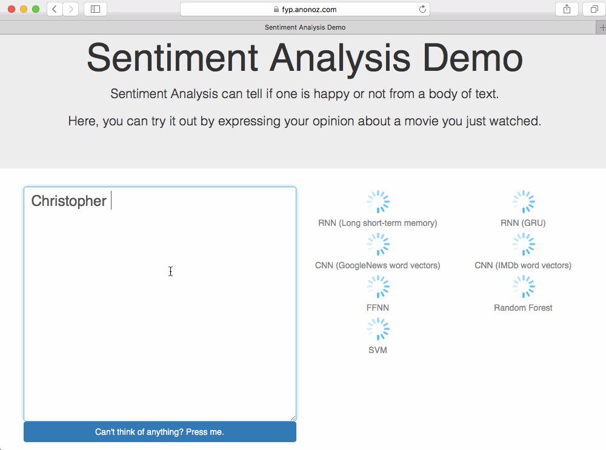

# [FYP] Demo Web App



## What Does This Do

The final objective of my final year project - Sentiment Analysis with Deep Learning is to build a web app so that people can test drive various sentiment classifiers with ease.

She has a simple interface for the user to enter or copy-paste movie reviews in, she will then request different sentiment classifier microservices, such as Genji (convolutional neural network with pre-trained word2vec), or Hanzo (convnet with self-trained word2vec), plus many others, and show it to the user. The user can choose to tell the system the correct sentiment polarity, that will allow researchers (actually no one) to look at the results and corrections.

Currently I am using it to learn distributed computing, tools like Docker, Kubernetes and stuff.

## Running it

### Recommended method: Docker Compose

I have already pushed the dependency images to Docker Hub. If you have Docker Engine installed, you can just clone this repo and run it:

```
# WARNING: You are about to download 1-2GBs of Docker images. Do not run this on slow or metered internet connections!

# Run these once (or everytime you git pull this codebase)
$ docker-compose build
$ docker-compose run web bundle exec rails db:migrate

# Then run this everytime you wanna play with it
$ docker-compose up

# Visit http://localhost:3001
# I used port 3001 on host is bcoz I serve this app on https://fyp.anonoz.com sometimes
```

LSTM, GRU, and CNN will take some time to start up. You will come see that they are offline for a few minutes (that depends on your PC performance, I ran this on MacBook Air).
